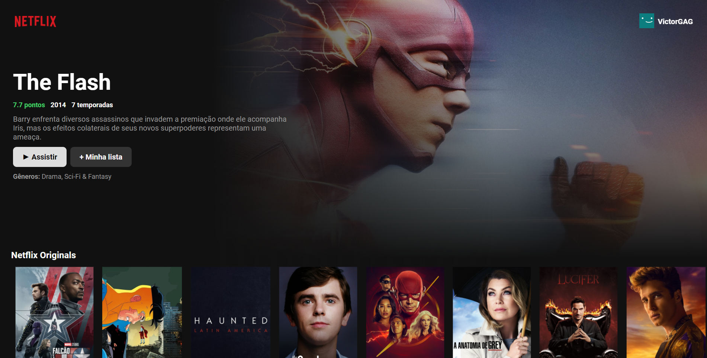

# NETFLIX CLONE - REAC
## Clone do netflix para usar de portifolio

<h1 align="center">
    <a href="https://pt-br.reactjs.org/">🔗 React</a>
</h1>

🚀 lib para construir interfaces do usuário com componentes reutilizáveis

<h4 align="center"> 
	🚧 Em construção...  🚧
</h4>

<!-- 

 <a href="#objetivo">Objetivo</a> •
 <a href="#roadmap">Roadmap</a> • 
 <a href="#tecnologias">Tecnologias</a> •

 -->

 <strike> qalquer problema de catalago referente a api não ao app </strike>

 Este é o clone do netflix, feito utilizando reactjs e a api do site themoviedb.

### Features 

- [x] Lista de filmes
- [x] Filme em exibição
- [ ] Mais informações
- [ ] Cadastro usuario e login
